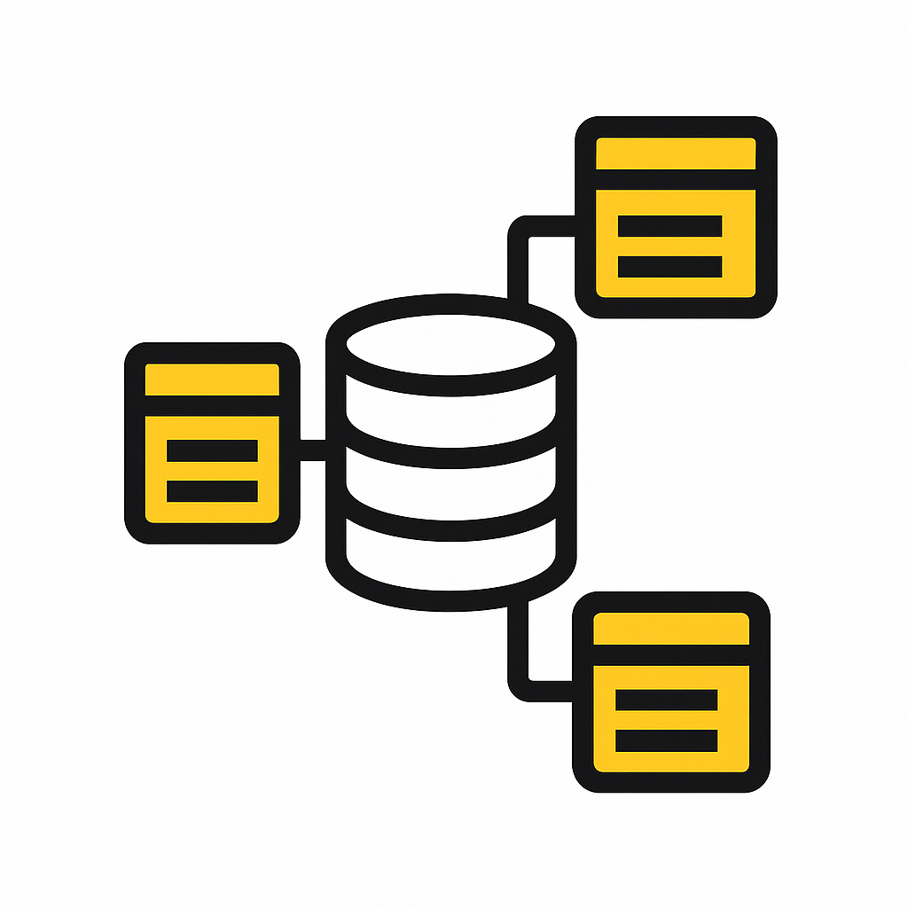
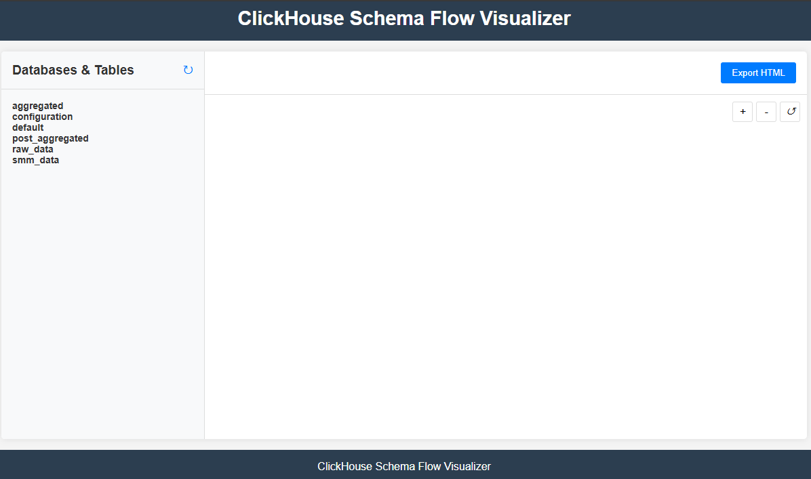
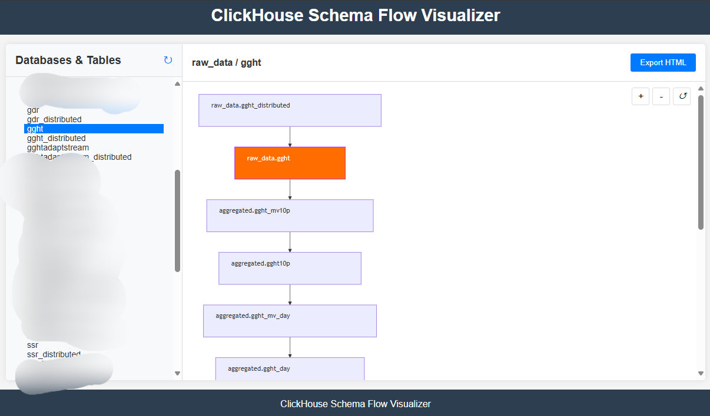

<div align="center">

# ClickHouse Schema Flow Visualizer



A powerful web application for visualizing ClickHouse table relationships using Mermaid.js diagrams.

[Build Status Badge] [License Badge] [Version Badge]

</div>

## 📸 Screenshots

<div align="center">






</div>

## ✨ Features

- 🔍 Browse ClickHouse databases and tables with an intuitive interface
- 📊 Visualize table relationships with Mermaid.js diagrams
- ↔️ View direction of data flow between tables
- 💾 Export diagrams as standalone HTML files
- 🔒 Secure connection to ClickHouse with TLS support
- 📱 Responsive web interface for all devices

## 🏗️ Architecture

- **Backend**: Golang with Gin framework
- **Frontend**: HTML, CSS, and JavaScript with Mermaid.js
- **Database**: ClickHouse

## 📋 Prerequisites

- Docker and Docker Compose
- ClickHouse server

## 🚀 Installation and Setup

### Using GitHub Container Registry

1. Pull the container from GitHub Container Registry:
   ```bash
   docker pull ghcr.io/fulgerx2007/clickhouse-schemaflow-visualizer:latest
   ```

2. Create a `.env` file with your ClickHouse connection details (see configuration example below)

3. Run the container:
   ```bash
   docker run -p 8080:8080 --env-file .env ghcr.io/fulgerx2007/clickhouse-schemaflow-visualizer:latest
   ```

4. Access the web interface at http://localhost:8080

### Using Docker Compose (Recommended)

1. Clone the repository:
   ```bash
   git clone https://github.com/fulgerX2007/clickhouse-schemaflow-visualizer.git
   cd clickhouse-schemaflow-visualizer
   ```

2. Start the application:
   ```bash
   docker-compose up -d
   ```

3. Access the web interface at http://localhost:8080

### Manual Setup

1. Clone the repository:
   ```bash
   git clone https://github.com/fulgerX2007/clickhouse-schemaflow-visualizer.git
   cd clickhouse-schemaflow-visualizer
   ```

2. Configure the `.env` file with your ClickHouse connection details:
   ```
   # ClickHouse Connection Settings
   CLICKHOUSE_HOST=localhost
   CLICKHOUSE_PORT=9000
   CLICKHOUSE_USER=default
   CLICKHOUSE_PASSWORD=
   CLICKHOUSE_DATABASE=default

   # ClickHouse TLS Settings
   CLICKHOUSE_SECURE=false
   CLICKHOUSE_SKIP_VERIFY=false
   # CLICKHOUSE_CERT_PATH=/path/to/cert.pem
   # CLICKHOUSE_KEY_PATH=/path/to/key.pem
   # CLICKHOUSE_CA_PATH=/path/to/ca.pem
   # CLICKHOUSE_SERVER_NAME=clickhouse.example.com

   # Web Interface Settings
   SERVER_ADDR=:8080
   GIN_MODE=debug
   ```

3. Install Go dependencies:
   ```bash
   cd backend
   go mod download
   ```

4. Run the application:
   ```bash
   go run main.go
   ```

5. Access the web interface at http://localhost:8080

## 📖 Usage

### 1. Browse Databases and Tables
- The left panel displays all available databases and tables
- Click on a database to expand/collapse its tables
- Click on a table to view its schema

### 2. View Table Relationships
- Select a table to see its relationships with other tables
- The diagram shows the table structure and relationships

### 3. Export Diagrams
- Click "Export HTML" to save the current diagram as an HTML file

## 🔧 How It Works

The application analyzes ClickHouse table structures by querying system tables:
- `system.tables` to get tables in each database

Relationships between tables are determined based on column names:
- Direction of data flow is determined automatically for:
  - distributed tables
  - materialized views
  - tables

## 👨‍💻 Development

### Project Structure

```
clickhouse-schemaflow-visualizer/
├── backend/
│   ├── api/         # API handlers
│   ├── config/      # Configuration handling
│   ├── models/      # Data models and ClickHouse client
│   └── main.go      # Application entry point
├── frontend/
│   ├── css/         # CSS styles
│   ├── html/        # HTML templates
│   └── js/          # JavaScript code
├── .env             # Environment configuration
├── Dockerfile       # Docker build instructions
├── docker-compose.yml # Docker Compose configuration
└── README.md        # Documentation
```

### Building from Source

1. Build the Docker image:
   ```bash
   docker build -t clickhouse-schemaflow-visualizer .
   ```

2. Run the container:
   ```bash
   docker run -p 8080:8080 --env-file .env clickhouse-schemaflow-visualizer
   ```

## 📄 License

This project is licensed under the MIT License - see the LICENSE file for details.

## 🤝 Contributing

Contributions are welcome! Please feel free to submit a Pull Request.
