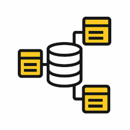

<div align="center">

# ClickHouse Schema Flow Visualizer



A powerful open-source web application for visualizing ClickHouse table relationships using Mermaid.js diagrams. Browse databases and tables with an intuitive interface, explore table metadata with optional row counts and size information, and export interactive schema diagrams.

[](https://github.com/FulgerX2007/clickhouse-schemaflow-visualizer/actions)
[](https://opensource.org/licenses/MIT)
[](https://github.com/FulgerX2007/clickhouse-schemaflow-visualizer/releases)
[](https://goreportcard.com/report/github.com/fulgerX2007/clickhouse-schemaflow-visualizer)

</div>

## 📸 Screenshots

<div align="center">


</div>

## ✨ Features

- 🔍 Browse ClickHouse databases and tables with an intuitive interface
- 📊 Visualize table relationships with Mermaid.js diagrams
- 🎨 Color-coded icons matching table types for better visualization
- ↔️ View direction of data flow between tables
- 📂 Collapsible table types legend for a cleaner interface
- 📈 Toggle metadata visibility (table rows and size information)
- 💾 Export diagrams as standalone HTML files
- 🔒 Secure connection to ClickHouse with TLS support
- � **Dual Client Architecture**: Switch between native TCP and HTTP clients
- 🌐 **HTTP Client Support**: Custom HTTP implementation with mTLS
- 📡 **RESTful API**: Programmatic access to schema information
- �📱 Responsive web interface for all devices

## 🏗️ Architecture

- **Backend**: Golang with Gin framework
- **Frontend**: HTML, CSS, and JavaScript with Mermaid.js
- **Database**: ClickHouse

## 📋 Prerequisites

- Docker and Docker Compose
- ClickHouse server

## 🚀 Installation and Setup

### Using GitHub Container Registry

1. Pull the container from GitHub Container Registry:
   ```bash
   docker pull ghcr.io/fulgerx2007/clickhouse-schemaflow-visualizer:latest
   ```

2. Create a `.env` file with your ClickHouse connection details (see configuration example below)

3. Run the container:
   ```bash
   docker run -p 8080:8080 --env-file .env ghcr.io/fulgerx2007/clickhouse-schemaflow-visualizer:latest
   ```

4. Access the web interface at http://localhost:8080

### Using Docker Compose (Recommended)

1. Clone the repository:
   ```bash
   git clone https://github.com/fulgerX2007/clickhouse-schemaflow-visualizer.git
   cd clickhouse-schemaflow-visualizer
   ```

2. Start the application:
   ```bash
   docker-compose up -d
   ```

3. Access the web interface at http://localhost:8080

### Manual Setup

1. Clone the repository:
   ```bash
   git clone https://github.com/fulgerX2007/clickhouse-schemaflow-visualizer.git
   cd clickhouse-schemaflow-visualizer
   ```

2. Configure the `.env` file with your ClickHouse connection details:
   ```
   # ClickHouse Connection Settings
   CLICKHOUSE_HOST=localhost
   CLICKHOUSE_PORT=9000
   CLICKHOUSE_USER=default
   CLICKHOUSE_PASSWORD=
   CLICKHOUSE_DATABASE=default

   # Client Mode Selection (NEW)
   CLICKHOUSE_USE_HTTP=false

   # ClickHouse TLS Settings
   CLICKHOUSE_SECURE=false
   CLICKHOUSE_SKIP_VERIFY=false
   # CLICKHOUSE_CERT_PATH=/path/to/cert.pem
   # CLICKHOUSE_KEY_PATH=/path/to/key.pem
   # CLICKHOUSE_CA_PATH=/path/to/ca.pem
   # CLICKHOUSE_SERVER_NAME=clickhouse.example.com

   # Web Interface Settings
   SERVER_ADDR=:8080
   GIN_MODE=debug
   ```

   **Client Mode Options:**
   - `CLICKHOUSE_USE_HTTP=false` - Use native TCP client (default, port 9000)
   - `CLICKHOUSE_USE_HTTP=true` - Use custom HTTP client (port 443, mTLS support)

3. Install Go dependencies:
   ```bash
   cd backend
   go mod download
   ```

4. Run the application:
   ```bash
   go run main.go
   ```

5. Access the web interface at http://localhost:8080

## Usage

1. Start the server:
   ```bash
   go run main.go
   ```

2. Open your browser and navigate to `http://localhost:8080`

3. Browse through the database tree on the left to see your ClickHouse databases and tables

4. **Table View**: Click on any table to view its individual schema diagram

5. **Database View**: 
   - Hold Shift or Ctrl and click on a database name to view the entire database schema
   - Use the "View Mode" selector in the toolbar to switch between Table and Database views
   - Use the engine filters to show/hide specific table types (MergeTree, Replicated, MaterializedView, Dictionary, etc.)
   - The database view shows all tables in the database with relationships and color-coded engine types

## 🔌 API Documentation

The application provides a comprehensive RESTful API for programmatic access to ClickHouse schema information. 

**📖 Full API Documentation: [API.md](API.md)**

### Quick API Reference:

| Endpoint | Method | Description |
|----------|--------|-------------|
| `/api/databases` | GET | List all databases and tables with metadata |
| `/api/table/:database/:table` | GET | Get detailed column information for a table |
| `/api/schema/:database/:table` | GET | Get Mermaid.js diagram schema for visualization |

### Client Mode Support:
The API automatically adapts to your chosen client mode:
- **Native TCP Mode** (`CLICKHOUSE_USE_HTTP=false`): Uses official ClickHouse driver
- **HTTP Mode** (`CLICKHOUSE_USE_HTTP=true`): Uses custom HTTP client with mTLS support

### Example Usage:
```bash
# Get all databases
curl "http://localhost:8080/api/databases"

# Get table details
curl "http://localhost:8080/api/table/default/users"

# Get schema for visualization
curl "http://localhost:8080/api/schema/default/users"
```

## 🔧 How It Works

The application analyzes ClickHouse table structures by querying system tables:
- `system.tables` to get tables in each database and determine their types
- `system.columns` to retrieve detailed column information

**Dual Client Architecture:**
- **Native TCP Client**: Uses the official ClickHouse Go driver for optimal performance
- **HTTP Client**: Custom implementation using Go's `net/http` with mTLS support for secure environments

Relationships between tables are determined based on column names:
- Direction of data flow is determined automatically for:
  - distributed tables
  - materialized views
  - replicated tables
  - regular tables
  - dictionaries


## 👨‍💻 Development

### Project Structure

```
clickhouse-schemaflow-visualizer/
├── api/             # API handlers
│   └── handlers.go  # RESTful API endpoint implementations
├── assets/          # Project assets
│   └── screenshots/ # Screenshots for documentation
├── config/          # Configuration handling
│   └── config.go    # Environment configuration loader
├── models/          # Data models and ClickHouse client
│   └── clickhouse.go # Dual client architecture (TCP/HTTP)
├── static/          # Frontend static files
│   ├── css/         # CSS styles
│   │   └── styles.css # Main stylesheet
│   ├── html/        # HTML templates
│   │   └── index.html # Main application page
│   ├── img/         # Images and icons
│   └── js/          # JavaScript code
│       └── app.js   # Main application logic
├── .env.example     # Example environment configuration
├── API.md           # Complete API documentation
├── bin/             # Compiled binary output (gitignored)
├── build.sh         # Build script to compile binary
├── docker-compose.yml # Docker Compose configuration
├── Dockerfile       # Docker build instructions
├── go.mod           # Go module dependencies
├── go.sum           # Go module checksums
├── main.go          # Application entry point with client selection
├── start.sh         # Start script for running the server
└── README.md        # Project documentation
```

### Building from Source

#### Local Development Build

1. Build the application:
   ```bash
   ./build.sh
   ```

2. Start the server:
   ```bash
   ./start.sh
   ```

The build script compiles the Go application and places the binary in the `bin/` directory. The start script will check if the binary exists and suggest running the build script if needed.

#### Docker Build

1. Build the Docker image:
   ```bash
   docker build -t clickhouse-schemaflow-visualizer .
   ```

2. Run the container:
   ```bash
   docker run -p 8080:8080 --env-file .env clickhouse-schemaflow-visualizer
   ```

## 📄 License

This project is licensed under the MIT License - see the LICENSE file for details.

## 🤝 Contributing

Contributions are welcome! Please feel free to submit a Pull Request.
